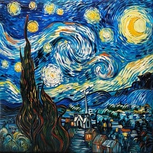

<html lang="en">
<head>
    <meta charset="UTF-8">
    <meta name="viewport" content="width=device-width, initial-scale=1.0">
    <link rel="stylesheet" href="estilo.css">
</head>
<body class="pagina">
    <h1 class="titulo">Gabriella Vilela Santos da Silva</h1>
    
Olá sou a Gabriella, mas pode me chamar de Gabi tenho 21 anos, natural do Rio de Janeiro. atualmente sou estudante da 
      área de <b>Análise e Desenvolvimento de Sistema. </b> Meus interesses sempre foram na área da tecnologia com: jogos, aplicativo(App), redes sociais.

         <ul class="lista" >
        <li>Desenhar</li>
              
        <li>Culinaria</li>
               
        <li>jogos</li>
             
    </ul>
   <table class="tabela">
    <tr class="país">
        <th>Japão</th>
        <th>Canadá</th>
        <th>Peru</th>
    </tr>
    <td > 
        
     </td>
     <td>
        
     </td> 
     <td>
        
    </td>
   </table>
   <a class="Instagram" href="https://www.instagram.com/gabriella__vilela/">Instagram</a>
   <button id="botao">Clique para ver uma mensagem!</button>
</body>
     
</html>
   
